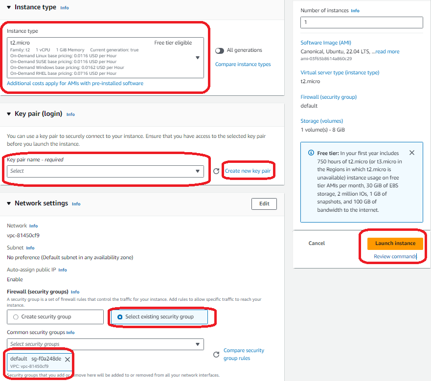
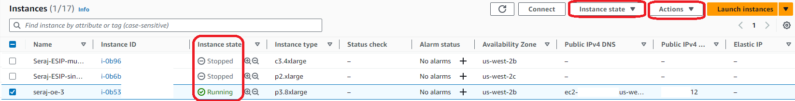
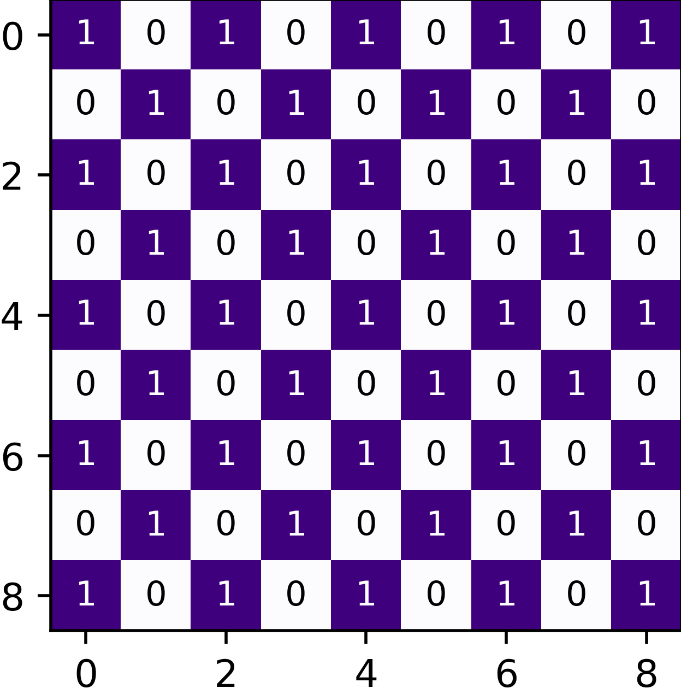

# Gravity Wave Localization
## Testing of images on AWS EC2
- First login to AWS and choose EC2 either from the Services (top left) or by searching it in the search box.

- In the EC2 console select the Launch instance button that will redirect to a page to select the EC2 virtual machine

- In the Name filed choose a unique name (name has be to unique for a specific region), then you can choose any AMIs, for example in this case, we chose Ubuntu as our AMI and from the dropdown there is an option to choose AMIs with more resources (which are paid services)

- Next, in the instance type any inastances can be selected using the dropdown. After selecting that, you need to select a key pair (if you do not have, you can create one here). Every user must have a key pair created and stored in the dir from where they want to access the EC2. Finally you can clink the Launch Instance button on bottom right.

- After the instance launched you can see their state (running or stopped) on EC2 console where you will be able to start, stop or terminate any instances you want using the Action button on top.

- Now, click on the instance id of the running instance that will let you connect from your PC using the connect button.

- Here, you can choose the SSH client tab to connect using a terminal. Please follow the steps from 1 to 4 and use the example ssh command to connect to the EC2 instance that was just created.

<!---
## What is Gravity Wave and what is our purpose in this work?

# gravity_wave_detection
## What is Gravity Wave and what is our purpose in this work?
Atmospheric gravity waves are a type of wave that occurs in the Earth's atmosphere caused by interplay between gravity and buoyancy forces. Atmospheric phenomena such as, global circulation and air turbulence are due to the presence of gravity waves. These waves have profound impacts on various aspects of the atmosphere, including the patterns of precipitation, cloud formation, ozone distribution, aerosols, pollutant dispersion etc. Therefore, understanding gravity waves is essential for comprehending and monitoring changes in a wide range of atmospheric behaviors. Limited studies have been conducted to identify gravity waves from satellite data using machine learning techniques. Particularly, without the need for noise removal, remains an underexplored area of research. This study presents a novel kernel design aimed at identifying gravity waves within satellite images. The proposed kernel is seamlessly integrated into the proposed deep neural network, denoted as \textbf{gWaveNet}. Our proposed model exhibits exceptional proficiency in detecting images containing gravity waves from noisy satellite data without any feature engineering. The empirical results prove the effectiveness of our proposed model with training accuracy exceeding 98\% and testing accuracy close to 94\%.

## Data
For this investigation, we used the Day/Night Band (DNB) images from the Visible Infrared Imaging Radiometer Suite (VIIRS) instrument onboard the Suomi NPP satellite \cite{gravity_wave_data}. VIIRS DNB observes board band upwelling radiance in the visible region. VIIRS DNB has a wide swath ($\sim$3000 km) and a relatively high spatial resolution at 1 km approximately. Pixels within a 6-minute granule ($\sim$4000x3000 pixels) are stored in a  Hierarchical Data Format version-5 (HDF5) \cite{hdf5}. The raw HDF5 files contain radiance measurements within the wavelength range of $0.5\mu m$ to $0.9\mu m$. To highlight the airglow from gravity wave events, nighttime images under new moon conditions are used in this study. As a result, the DNB radiance could be extremely low with a value in the order of magnitude of $-10^{-9}$W/$cm^{-2}$$sr^{-1}$. To comprehend easily, we performed preprocessing on the raw data, ensuring that the array values are within a specific range while maintaining their relative distribution \cite{gonzalez2022atmospheric}. This involved subtracting the minimum value from all array elements, scaling by the median, and normalizing to 0.5. Normalizing to this reference point enables easier visual comparison and analysis of the data. Finally, we transformed the intensity distribution from an approximate normal distribution to a uniform one, while preserving the accurate range of values. These measurements were collected in twelve 1000x1000 pixels, as shown in Figure \ref{fig:prep}. Figure \ref{fig:gwngw} is an example of images with and without gravity waves.

## Proposed Network
First, we present \textit{gWaveNet}, a hybrid neural network architecture that combines both trainable and non-trainable layers. Next, we introduce a unique kernel specifically designed to detect various shapes within our data. This kernel plays a crucial role in our methodology. Notably, we integrate the kernel into the initial layer of \textit{gWaveNet}, effectively incorporating its capabilities into the overall model.

Our proposed \textit{gWaveNet} is a deep convolutional network that has 15 layers that comprise 6 convolutional layers, 6 max-pooling layers, 2 dense layers, and 1 dropout layer (Figure~\ref{fig:model}). The model is designed for binary classification tasks on grayscale images. We integrated the proposed kernels in the first layer making it either trainable or non-trainable, followed by alternating convolutional and max-pooling layers, which successively extract features and reduce spatial dimensions. L2 regularization is applied in the second convolutional layer to reduce any overfitting caused by the custom kernel in the first layer. After the final max-pooling layer, the output tensor is flattened, and the data passes through a dense layer, a dropout layer, and a final sigmoid-activated dense layer for binary classification.

Since our dataset contains excessive noise including the horizontal lines, we designed the kernel in such a way that can capture all types of gravity wave shapes excluding the horizontal lines. We used the kernel in the first layer of our proposed deep-learning model motivated by the Laplacian filter, to generate low-level features from input grayscale images. The first layer of the model is configured both as trainable and non-trainable to validate its effectiveness for generating domain-specific features from the dataset.

## Emperical Evaluation
In this section, we describe the extensive experiments and its evaluation with customizing the layers of the model, getting the right regularizer, optimization, and loss function in following subsections.

### Experimental Setup
For our experimental evaluation, we use the gravity wave dataset assigned to either gravity wave or non-gravity wave classes. The performance of the proposed model is compared with three state-of-the-art approaches. Our proposed model is implemented using Keras 2.11 and TensorFlow 2. To train and test the proposed model and baseline models we used a GPU machine with 20GB RAM. Most of the models are trained for 2,000 epochs with a batch size of 128 on the training dataset. Where the training and validation dataset is split into 65:35 ratio, and 240 patches for testing only. Specifically, the models trained with FFT denoised data and the gWaveNet model without the custom kernel were trained for an extended number of epochs (2500 and 3000, respectively) to evaluate if longer training improves their performance. The hyper-parameters of each baseline method are kept intact to experiment with our data.   
%\vspace*{-3mm}

### Evaluation Metrics
To compare the performance of baseline models with our proposed model different evaluation metrics were used such as overall detection accuracy, the area under the curve, precision, recall, and $F1$ score~\cite{eval2021}. The $F1$ score is computed using the precision and recall values of the testing dataset. The overall accuracy of the model is measured from the detection accuracy of each individual gravity weave instance detected from the test images.

### Optimization and Loss Function
Our proposed model aims to differentiate between gravity wave images and noisy non-gravity wave images. To achieve this, we utilize the binary cross entropy loss function to calculate the detection loss during the model's training process. The stochastic gradient descent (SGD) method with the binary cross entropy loss objective function is used to optimize our proposed model. SGD \cite{sun2019survey} is a commonly used optimization method in deep learning to train on large datasets. Instead of calculating the gradient from the entire dataset, SGD estimates gradients using a smaller batch of data, reducing the complexity of gradient calculation. Although SGD has a common feature of gradient fluctuations due to batch gradient updates, it provides a better chance of finding the global optimal solution for complex problems \cite{wilson2017marginal}. This optimization process resulted in a smooth learning trend and generalized feature learning in the model.

## Results
### Comparing with State-of-the-art Techniques
We evaluated our model against three state-of-the-art techniques in computer vision research, including the Gabor filter \cite{fogel1989gabor}, Sobel filter \cite{kanopoulos1988design}, and Laplacian filter \cite{wang2007laplacian}. The Gabor filter is capable of selecting various orientations, including the imaginary part derived from a sinusoidal wave modulated by a Gaussian envelope. The Sobel filter is widely employed as a preprocessing step for tasks such as edge detection, image segmentation, and feature extraction. On the other hand, the Laplacian filter is effective in detecting edges with corners as well as extracting significant features within an image.

To compare our model with the existing techniques, we explored various approaches and obtained different results, which are summarized in Table~\ref{tab:baselinecomp} where the best results in each category are in bold and the overall best results are underlined. First, we incorporated Gabor filters of size 7x7 with different orientations (0°, 30°, 60°, 120°, 150°) into our deep learning model. This process yielded high accuracies with an F1 score of 82.35\%, although the optimization plot showed fluctuations in both accuracies and loss. Secondly, we applied the Sobel filters (using 3x3 kernels) as a preprocessing step before training the model, and we also integrated the filters into our proposed method during training. The results in Table~\ref{tab:baselinecomp} show that the model trained with integrating Sobel filters in the first layer achieved higher accuracy and F1 score compared to the model trained on images pre-processed by Sobel filters. We followed the same process for the Laplacian filter, using a 7x7 kernel. The results showed a similar pattern, with greater accuracy obtained when the Laplacian filter was integrated into the model as opposed to utilizing it as a data preprocessing step. However, the model has an overfitting issue in all instances of the Sobel and Laplacian filter application. 

Referring to the \textit{gWaveNet}, we see that, our approaches outperform all of the aforementioned techniques in terms of F1 scores. Our proposed model with trainable 7x7 and 5x5 custom kernels has the best results considering all accuracies and losses. Moreover, the training accuracies and losses are found to be better optimized with no overfitting problem.

### Comparing with FFT Denoised Data
We further evaluated the proposed approach using the FFT denoising technique used in our previous work \cite{gonzalez2022atmospheric}. For this experiment, we applied the FFT technique on images and then trained three variations of the proposed model, \textit{i)} the model without applying the proposed kernel, \textit{ii)} the model with a 7x7 trainable kernel, and \textit{iii)} the model with a 7x7 non-trainable kernel. Our experiments demonstrated that the highest accuracy achieved with FFT-denoised images was approximately 93\% for the training dataset, which is lower than the performance of our proposed model using noisy data. This finding is consistent with the observation that the dataset we have is quite intricate. Further analysis of the FFT denoised images uncovered that certain presence of gravity waves are lost due to the conversion process. Figure~\ref{fig:fft-denoised} shows the potential loss of some gravity wave features following denoising. This observation served as additional inspiration for us to develop a model that can detect gravity waves with higher accuracy without relying on denoised data.

### Ablation Study

We conducted an ablation study to explore different variations in our experiment. Specifically, we investigated the impact of incorporating our proposed custom kernel by (i) configuring the custom kernel layer to be trainable and non-trainable, and (ii) using different kernel sizes. 
%-trainable layers, and (iii) applying the kernels directly on the images before training the model. 
The comprehensive evaluation of our ablation study, as depicted in Table~\ref{tab:baselinecomp}, yielded notable results. The best-performing model achieved an overall accuracy of 98.15\% using a 7x7 kernel with trainable layers. During the training phase, this model attained an impressive accuracy of 98.43\%, while the validation accuracy reached 97.22\% and the test accuracy stood at 93.75\%. Furthermore, the model employing a 7x7 non-trainable kernel demonstrated significant performance, achieving an overall training accuracy of 97.78\% with top training, validation, and test accuracy of 98.10\%, 96.53\%, and 97.91\% respectively. Additionally, the model with a non-trainable custom kernel layer achieved a training accuracy of 97.53\%. Interestingly, models that did not directly integrate the kernels into the model but instead applied them to the images before training still achieved overall accuracy exceeding 97\%. 

Additionally, we used the area under the curve (AUC) score to evaluate the learning capability of the model, which reached an impressive 97.25\%. Finally, we employed the F1 score as an evaluation metric for the test cases, utilizing data that was never part of the training process. The F1 score demonstrated a strong performance of 90\% for models with trainable kernels, further affirming the effectiveness of the model in accurately classifying test data. Overall, the results obtained from the various combinations explored in our ablation study consistently highlight the outstanding performance of our proposed custom kernel model.

### Overall Observation

In this work, we encountered challenging data characterized by noisy and complex patterns of non-linear shapes, making straightforward classification difficult. Consequently, our focus was on leveraging the unique kernel integrated within the \textit{gWaveNet} model to address these challenges effectively. In Table~\ref{tab:baselinecomp}, we compared our model with various state-of-the-art computer vision techniques. Our experiments revealed that the right kernel can improve the performance a lot especially when it comes to data such as satellite gravity wave images which is noisy and non-uniform ripple-like patterns that need to be extracted from it. Additionally, we found that, bigger kernel aids in detecting repeated shapes of various thicknesses as it covers a wider area. Moreover, we see, there are significant differences using a kernel not only with the right shape but also with the right coefficients, as compared to the proposed 7x7, 5x5 kernels in \textit{gWaveNet} with Gabor, Sobel or Laplacian filters. Notably, when comparing the F1 scores of the proposed model with other approaches, our model significantly outperforms the state-of-the-art techniques. Figure~\ref{fig:f1-diff} illustrates the average, as well as individual differences in F1 scores between the proposed and other approaches, providing further clarification on the performance of our model.

`
# Table of Contents
 >> ### 1. [What is Ocean Eddy?](https://github.com/big-data-lab-umbc/aws-automation/tree/main/gpu-example/OceanEddy#:~:text=README.md-,What%20is%20Ocean%20Eddy%3F,-The%20term%20eddy)
 >> ### 2. [SageMaker based Configuration](https://github.com/big-data-lab-umbc/aws-automation/tree/main/gpu-example/OceanEddy#:~:text=Configuring%20SageMaker%20for%20Ocean%20Eddy%20classification%20model)
 >> ### 3. [EC2 based Configuration](https://github.com/big-data-lab-umbc/aws-automation/tree/main/gpu-example/OceanEddy#3-configuring-ec2-for-ocean-eddy-classification-model:~:text=3.%20Configuring%20EC2%20for%20Ocean%20Eddy%20classification%20model)
`
 -->
